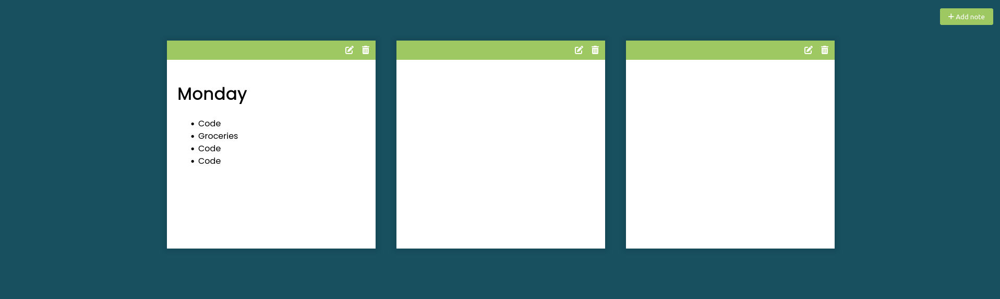

# Notes App

- Save to local storage using the browser built in local storage API
- Using Markdown with a small library called [marked](https://marked.js.org/ "marked")

## JavaScript Part

- Adding Notes to the DOM
- Save Notes to Local Storage

## Sreenshots

